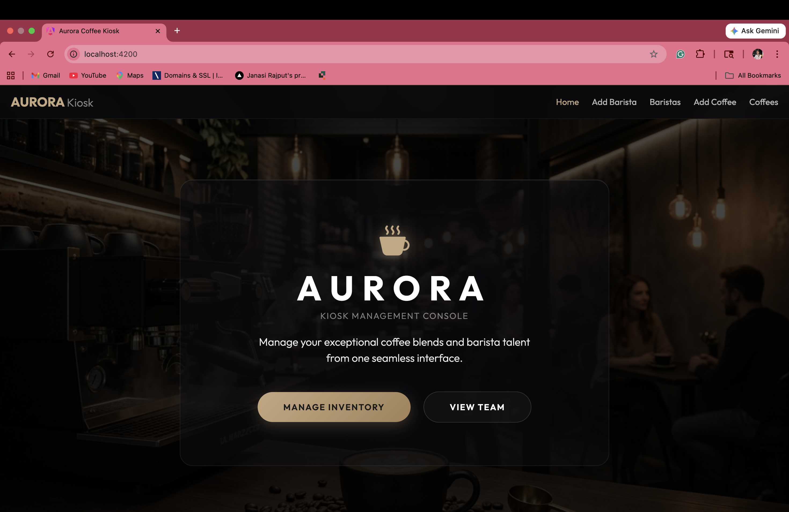
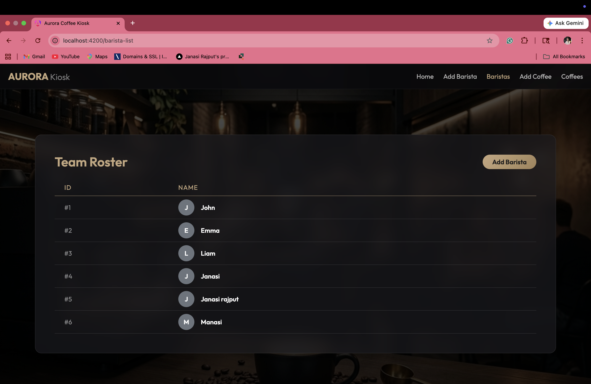
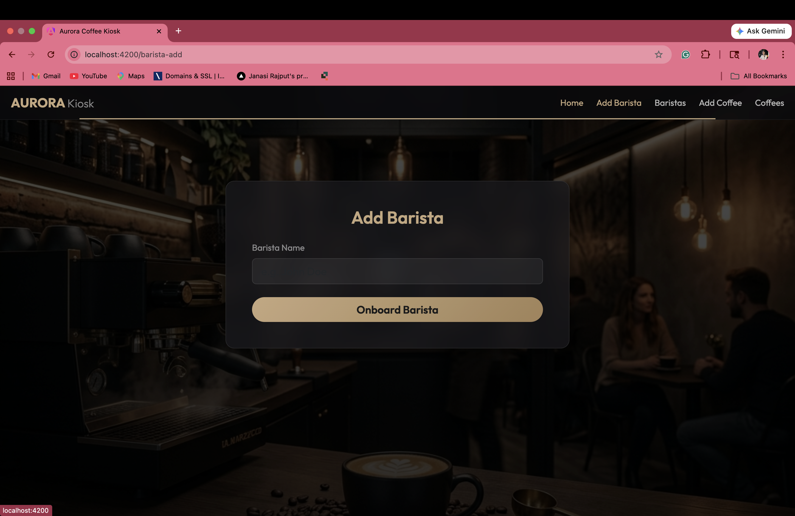
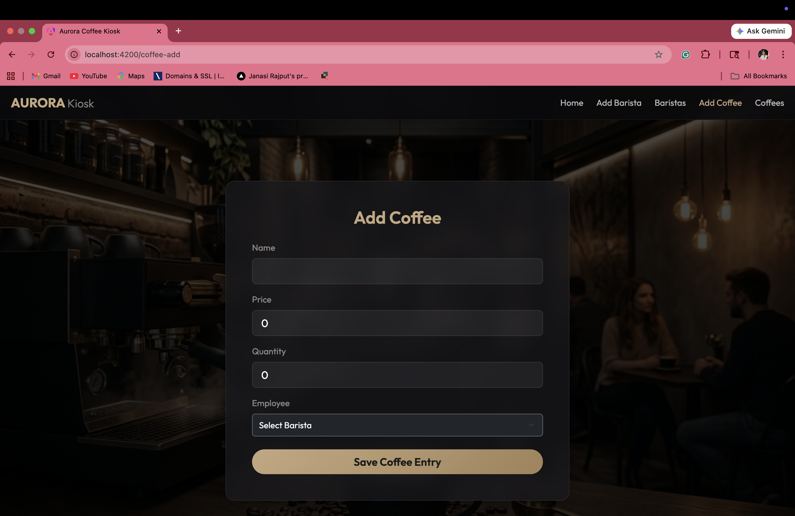
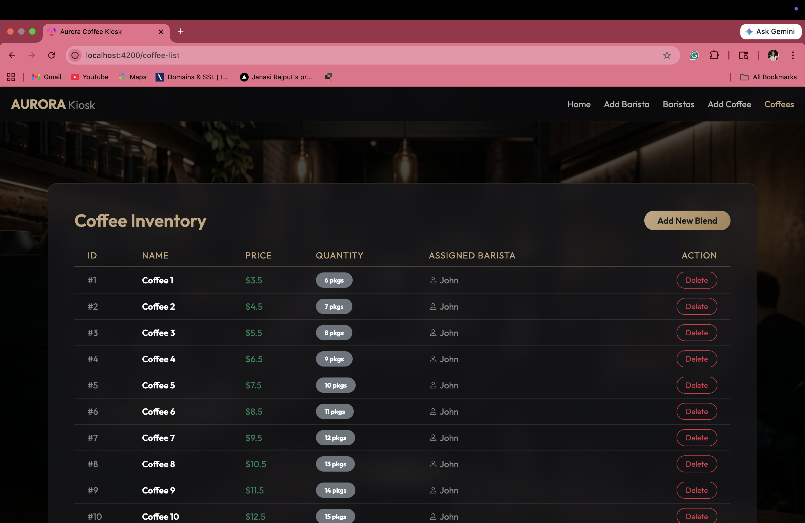

# Aurora Kiosk Management System 

A premium, full-stack web application designed to manage cafe inventory and personnel. The application features a robust Java Spring Boot architectural backend serving an elegant, modern "Glassmorphism" Angular client interface.







## 🚀 Features

- **Spring Boot REST API**: Implements scalable RESTful endpoints. Stores `Barista`, `Coffee`, `Kiosk`, and `Sale` entities natively using Spring Data JPA and Hibernate.
- **Smart Operations Dashboard**: Integrated a data-driven "Insights" panel featuring real-time **Revenue Tracking**, **Usage Trends**, and **Peak-Time Performance analysis** powered by custom SVG charting.
- **Data Insights Module**: Features automated performance scoring ("Top performing kiosks") and rule-based efficiency alerts (e.g., flagging low-efficiency units for maintenance) derived from historical telemetry.
- **Data Bootstrapping**: Features automated database population algorithms on startup, initializing staff, inventory, and **30 days of randomized historical sales data** (450+ records) for immediate analytics testing.
- **Angular 19+ Client Application**: Single Page Application leveraging modern, strictly-typed reactive routing to deliver lightning-fast component swaps without page reloads.
- **Glassmorphism UI Design**: Complete UI overhaul utilizing deep Bootstrap integration, dark gradients, glass-panel filtering, and responsive grids for a state-of-the-art cinematic aesthetic.
- **Unified Build Pipeline**: Automated synchronization utilizing NPM scripts that compiles the Angular source and silently hot-swaps all web artifacts directly into the Spring Boot `/static` assembly directory.
- **Professional Testing Suite**: A dedicated `/testing` layer containing comprehensive manual test cases, automated Postman API collections, and regression plans to ensure enterprise-grade stability.

## 🛠️ Technology Stack
- **Backend:** Java, Spring Boot, Spring Web, Spring Data JPA, H2 In-Memory Database
- **Frontend:** Angular CLI, HTML5, CSS3, Bootstrap 5.3, Bootstrap Icons
- **Tooling:** Maven, npm, Node.js.

## 💻 Running Locally

To launch the Aurora Kiosk locally, ensure you have both **Java** and **Node.js** installed on your machine.

### 1. Compile the Angular UI
To connect the frontend, you must compile the angular data into the Spring Boot architecture.
Navigate to the frontend source folder:
```bash
cd src/main/webapp/
```
Install the local frontend build dependencies:
```bash
npm install
```
Compile the application:
```bash
npm start
```
*(Note: Because of our automated `predeploy`/`deploy` hooks in `package.json`, this command will automatically compile Angular and copy over all resulting `index.html` and `.js` files perfectly into `src/main/resources/static/`!)*

### 2. Launch Spring Boot
Return to the Root folder of the project.
Open the project within your favorite IDE (Eclipse, IntelliJ IDEA, VSCode) and run:
`ca.sheridancollege.rajputja.Assignment2BristaApplication.java`

Alternatively, using Maven in the terminal:
```bash
./mvnw spring-boot:run
```

### 3. Explore
Launch your web browser and navigate seamlessly to:
**[http://localhost:8080/](http://localhost:8080/)**

## 🧠 Architectural Deep Dive: Smart Analytics

This project demonstrates a sophisticated integration between data engineering, backend intelligence, and professional frontend visualization.

### 1. Data Population & Engineering
The analytics dashboard is powered by an automated **Historical Data Engine** located in `BootstrapData.java`. 
- **The Seeding Algorithm**: On application startup, the system detects if the database is initialized. If not, it leverages `java.util.Random` and `LocalDateTime` to simulate **30 days of historical sales history**.
- **Distribution**: Sales are randomized across different coffee types (Espresso, Latte, etc.) and specific Kiosk locations, creating a realistic "noisy" dataset that allows the charting engine to demonstrate meaningful trends.
- **Volume**: By generating 450+ records instantly, the system provides a "Warm Start" experience for testing analytics without manual data entry.

### 2. Intelligent Service Layer (`InsightService`)
While the database holds raw records, the `InsightService` acts as the project's brain:
- **Rule-Based Scoring**: It calculates "Efficiency Scores" for each kiosk based on weighted throughput and operational status.
- **Predictive Alerts**: The service identifies kiosks under maintenance or performing below specific thresholds and generates real-time "Intelligence Alerts" for the dashboard.
- **Data Transformation**: It aggregates raw `Sale` entities into the Map-based structures (e.g., `Revenue-by-Location`) required by the REST controllers.

### 3. Professional Frontend Visualization
The Angular dashboard avoids "heavy" third-party charting libraries to maintain a lightweight, cinematic aesthetic:
- **SVG Charting Engine**: The 30-day revenue trend is rendered using highly-optimized **SVG paths** (`<svg> <path>`). Coordinates are calculated dynamically from the backend data to create a high-fidelity line chart.
- **CSS Animations**: Leverages a `draw-path` CSS animation that "sketches" the chart on load for a premium, interactive feel.
- **Reactive Updates**: Utilizes `ChangeDetectorRef` to ensure that data fetched asynchronously from the REST API is immediately visually represented without UI lag.

## 🧪 Quality Assurance (QA)
This project includes a professional-grade testing layer located in the `/testing` directory:
- **Manual Test Cases**: Comprehensive scenarios for UI and navigation validation.
- **REST API Automation**: Postman collections for testing all backend endpoints.
- **Regression Suite**: Re-test plan to ensure baseline stability after the analytics upgrade.
- **Test Strategy**: Outlines the testing methodology and pass/fail criteria.

## 📡 API Reference
New analytics endpoints added for the Smart Operations Dashboard:
- `GET /api/v1/sales/summary`: Returns itemized sales amounts.
- `GET /api/v1/analytics/revenue`: Real-time revenue breakdown by kiosk location.
- `GET /api/v1/analytics/insights`: Efficiency rankings for operational units.
- `GET /api/v1/analytics/alerts`: Automated status and performance alerts.
- `GET /api/v1/analytics/peak-times`: Traffic distribution by operating hour.
- `GET /api/v1/analytics/revenue/trend`: 30-day historical revenue data points.
