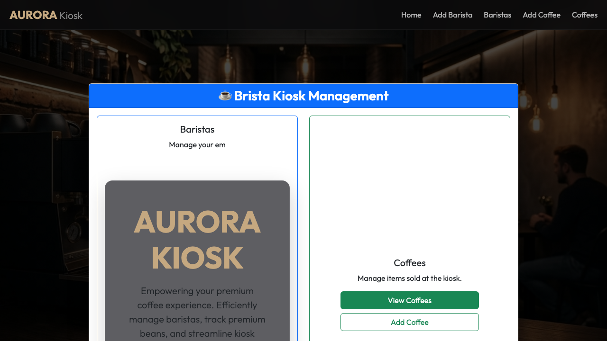

# Aurora Kiosk Management System (Assignment 2)

A premium, full-stack web application designed to manage cafe inventory and personnel. The application features a robust Java Spring Boot architectural backend serving an elegant, modern "Glassmorphism" Angular client interface.



## 🚀 Features

- **Spring Boot REST API**: Implements scalable RESTful endpoints. Stores `Barista` and `Coffee` entities natively using Spring Data JPA and Hibernate.
- **Data Bootstrapping**: Features automated database population algorithms on startup, instantly initializing staff and inventory for immediate testing.
- **Angular 19+ Client Application**: Single Page Application leveraging modern, strictly-typed reactive routing to deliver lightning-fast component swaps without page reloads.
- **Glassmorphism UI Design**: Complete UI overhaul utilizing deep Bootstrap integration, dark gradients, glass-panel filtering, and responsive grids for a state-of-the-art cinematic aesthetic modeled after industry-leading cafe brands.
- **Unified Build Pipeline**: Automated synchronization utilizing NPM scripts that compiles the Angular source and silently hot-swaps all web artifacts directly into the Spring Boot `/static` assembly directory, allowing the entire stack to be served natively over a single local Tomcat port.

## 🛠️ Technology Stack
- **Backend:** Java, Spring Boot, Spring Web, Spring Data JPA, H2 In-Memory Database
- **Frontend:** Angular CLI, HTML5, CSS3, Bootstrap 5.3, Bootstrap Icons
- **Tooling:** Maven, npm, Node.js.

## 💻 Running Locally

To launch the Aurora Kiosk locally, ensure you have both **Java** and **Node.js** installed on your machine.

### 1. Compile the Angular UI
To connect the frontend, you must compile the angular data into the Spring Boot architecture.
Navigate to the frontend source folder:
```bash
cd src/main/webapp/
```
Install the local frontend build dependencies:
```bash
npm install
```
Compile the application:
```bash
npm run build
```
*(Note: Because of our automated `predeploy`/`deploy` hooks in `package.json`, this command will automatically compile Angular and copy over all resulting `index.html` and `.js` files perfectly into `src/main/resources/static/`!)*

### 2. Launch Spring Boot
Return to the Root folder of the project.
Open the project within your favorite IDE (Eclipse, IntelliJ IDEA, VSCode) and run:
`ca.sheridancollege.rajputja.Assignment2BristaApplication.java`

Alternatively, using Maven in the terminal:
```bash
./mvnw spring-boot:run
```

### 3. Explore
Launch your web browser and navigate seamlessly to:
**[http://localhost:8080/](http://localhost:8080/)**
